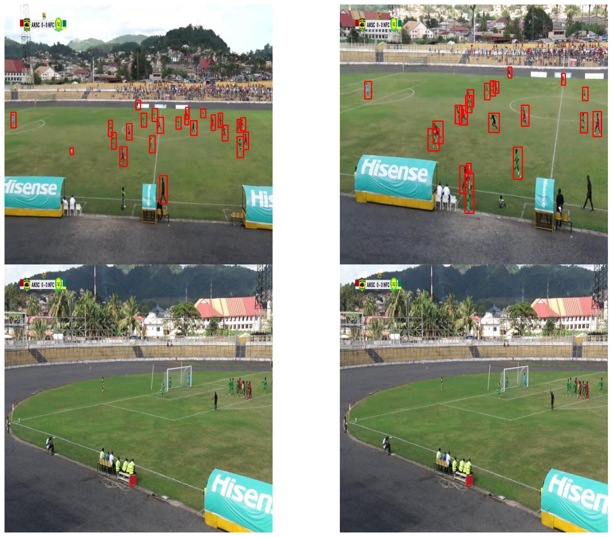
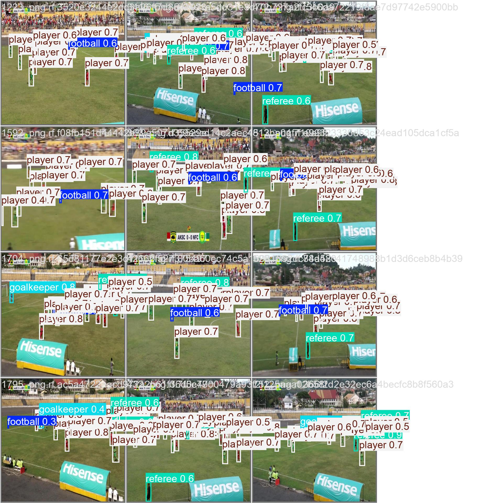

# Fine Tuning Yolov11 On Football Dataset

**Fine-Tuning YOLOv11 for Football Data
Prerequisites:**
 * YOLOv11: Ensure you have YOLOv11 installed and configured. You can refer to the official Ultralytics YOLO repository for installation instructions.
 * Python: Python 3.x is recommended.
 * Basic understanding of object detection: Familiarity with concepts like bounding boxes, labels, and model training.
 * A football dataset: This dataset should contain images of football matches with annotations for objects of interest, such as players, balls, referees, etc.

Transfer Learning: Use a pre-trained YOLOv11 model as a starting point and fine-tune it on your football dataset.
By following these steps and continuously iterating on your training process, you can fine-tune YOLOv11 to achieve high performance on your football dataset.

 * Create a Roboflow Dataset:
   * Upload Images: Upload your football image dataset to Roboflow.
   * Annotate Images: Use Roboflow's intuitive annotation tools to label objects of interest, such as players, balls, and referees.
   * Version Control: Create different versions of your dataset to experiment with different annotation strategies and data augmentation techniques.
   * Export Dataset: Export your dataset in YOLO format, which is compatible with YOLOv11.

### If you find this helpful 👌, please consider following and starring 🌟 this repository. Your support means a lot!😎